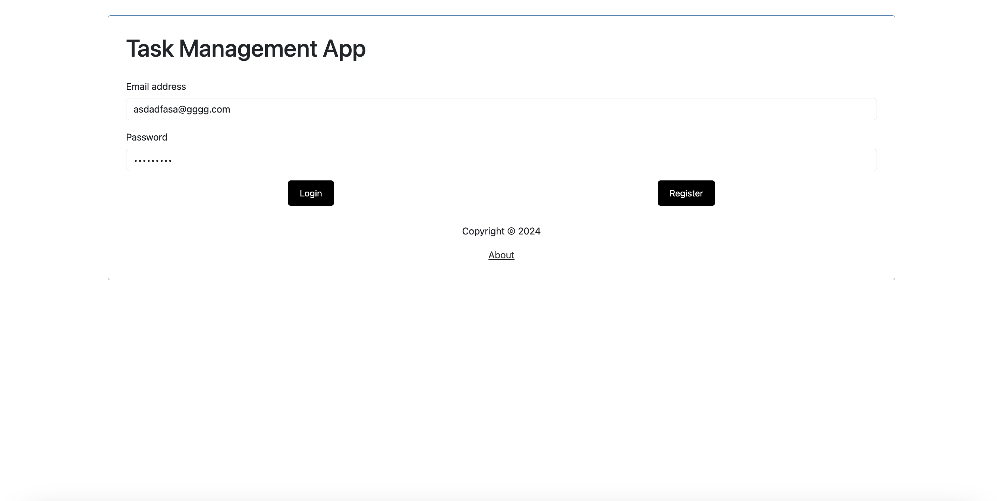
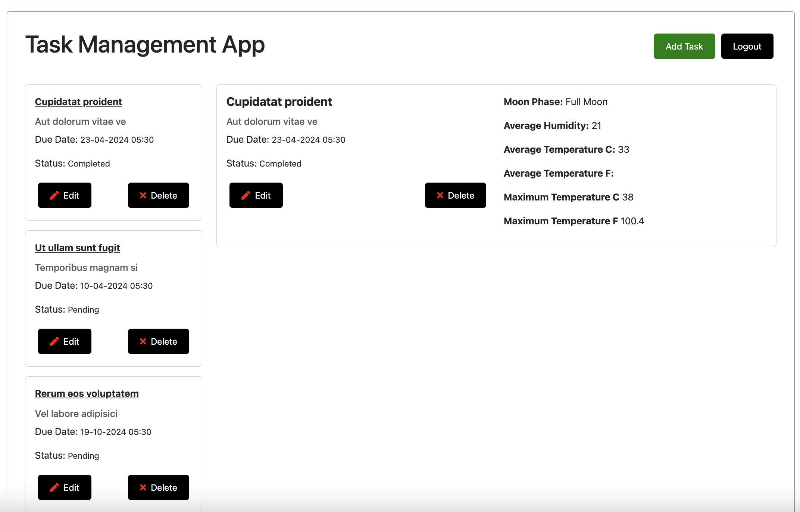
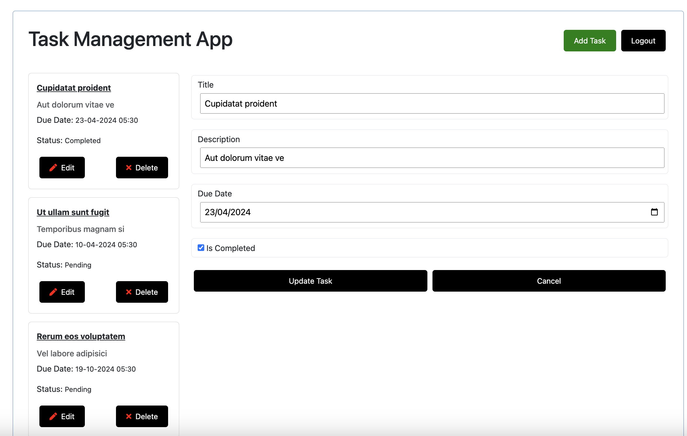
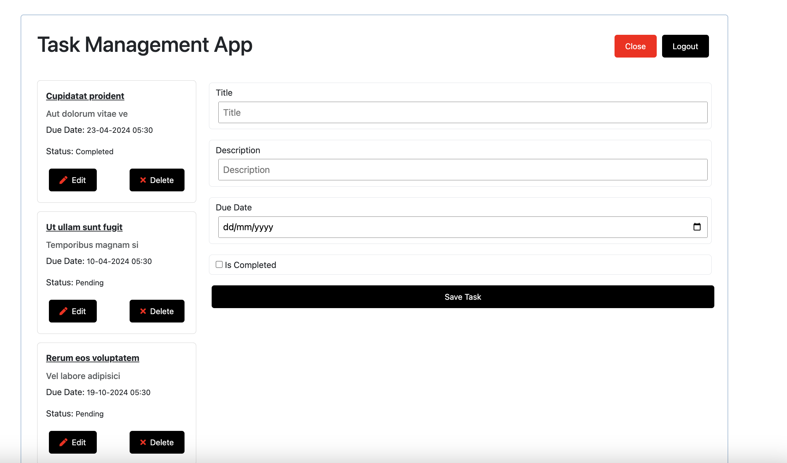
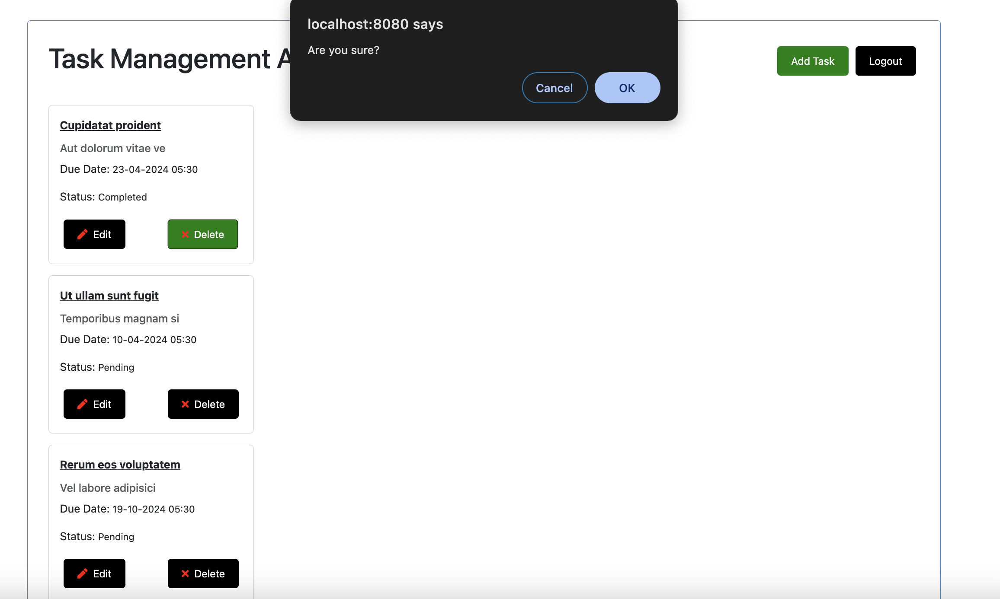

# Task Manager

> A small project to manager your task with due date.

## Project setup

```
npm install
```

## Run the Vue dev server (http://localhost:8080)

```
npm run serve
```

## Compiles and minifies for production

```
npm run build
```

```
CRUD operations with user authentication. Will add new features later.
```









